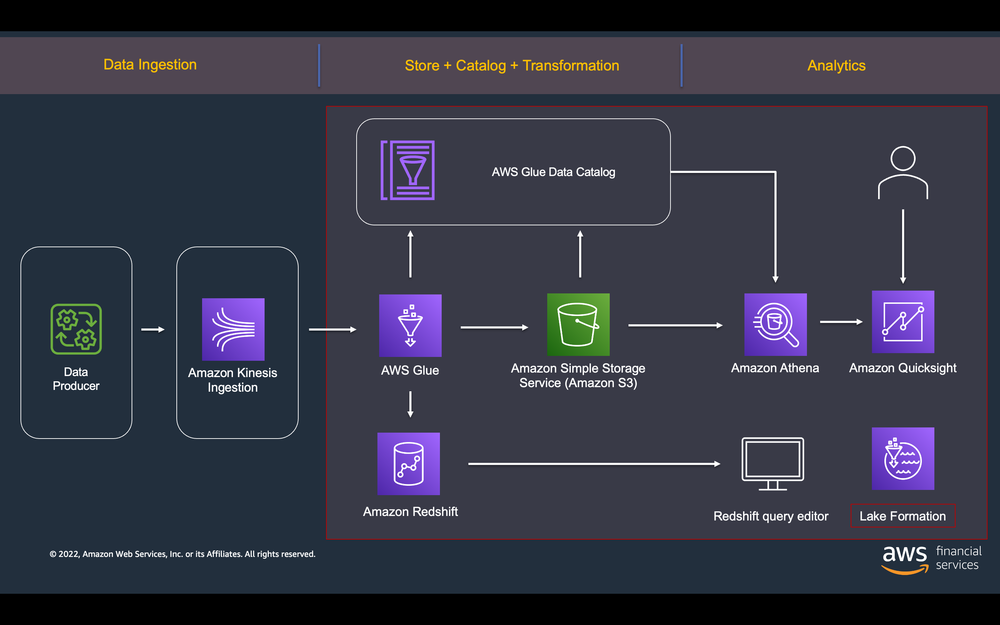

# FX Trader Workshop


<!-- ABOUT THE PROJECT -->
## About The Project

This project demos a FX trader example app where trade execution data is placed on to a kinesis data stream, ingested using AWS Glue Structured Streaming and copied to S3 in Parquet format using a Glue Job and Glue Data Catalogue. This data is made avaiable in Amazon Athena via an external AWS Glue table.

The project is deployed using Cloudformation with 2 exclusions:

1. An example AWS Glue job is configured, however, it would be great to create your own glue job to build your own ETL. There are instructions to do this included in the the FX Trader Workshop

2. Quicksight is not configured so participants need to configure this themselves, which is a great learning opportunity. This is done as part of the FX Trader Workshop


## High Level Architecture
---

### AWS Services Used
<!-- ABOUT THE PROJECT -->

  - Amazon Kinesis
  - AWS Glue
  - Amazon S3
  - Amazon Athena
  - AWS Quicksight




---

## Getting Started

Log into the CLoud9 environment set up by CloudFormation and run the following command:

```
sh environment/setup.sh
```

## Generating trade data

To create FX Trade Data, run the ```trade_executor.py``` in the root of the directory and ensure you have IAM permissions to invoke the fx-trade-results lambda.

```
python trade_executor.py

```

Once the FX Trdae Data script is producing data, start the fx-trade-stream-job-glue to process the data within the Kinesis stream.

 ### Author

 Oli Leach - AWS Principal Solution Architect

 ---